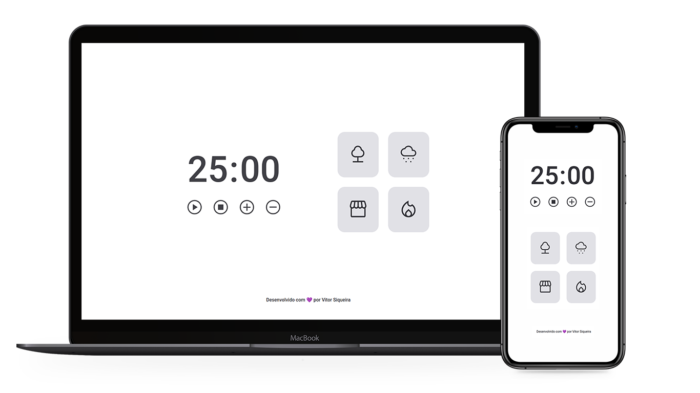

<p align="center">
  <a href="#-focustimer">About</a>&nbsp;&nbsp;&nbsp;|&nbsp;&nbsp;&nbsp;
  <a href="#-technologies">Technologies</a>&nbsp;&nbsp;&nbsp;|&nbsp;&nbsp;&nbsp;
  <a href="#-run-locally">Execute locally</a>&nbsp;&nbsp;&nbsp;|&nbsp;&nbsp;&nbsp;
  <a href="#-license">License</a>&nbsp;&nbsp;&nbsp;|&nbsp;&nbsp;&nbsp;
  <a href="#-developer">Develoepr</a>
</p>

<h2 align="center">FocusTimer 2.0</h2>
<div align="center">
  
</div>

## ⏲️ FocusTimer

FocusTimer is a timer app which was developed as a part of the Explorer program by [Rocketseat](htttps://rocketseat.com.br).
The main idea is to apply the study technique known as [Pomodoro](https://todoist.com/productivity-methods/pomodoro-technique) to focus in
important daily tasks like studying, coding, writing, and whatsoever task you
need to focus to.
#### Functionalities

- **Adjust time**: add or take away 5 minutes to your focus time (*default: 25min*)
- Pause time if you need
- Choose background theme song
- Timeout alert

## 🚀 Technologies

- HTML5
- CSS3
- JavaScript (ESModules)

## 💻 Run locally

- clone this repo

```bash
  git clone git@github.com:vmsiqueira/focustimer.git
```
- access your project directory
- run the `index.html` file by double clicking on it.

## ⚖️ License

This project is under MIT License. Check the [LICENSE](https://github.com/vmsiqueira/focustimer/blob/main/LICENSE) file for more details.

## ✨ New features added

- Dark mode
- Volume controls for background audios


## 🌐 Developer
 <br>
- [Vitor Siqueira](https://www.github.com/vmsiqueira)

[](https://www.linkedin.com/in/vitor-siqueira-149a88201/)

---
Made with 💜 as part of my developer formation.

